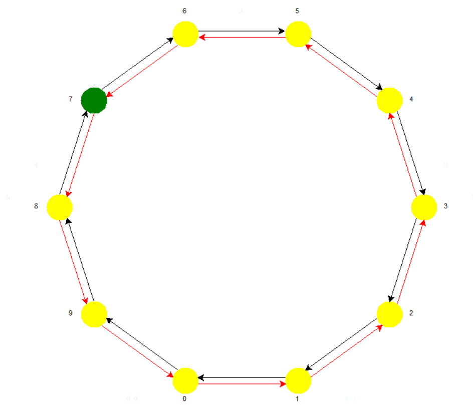
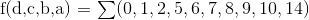
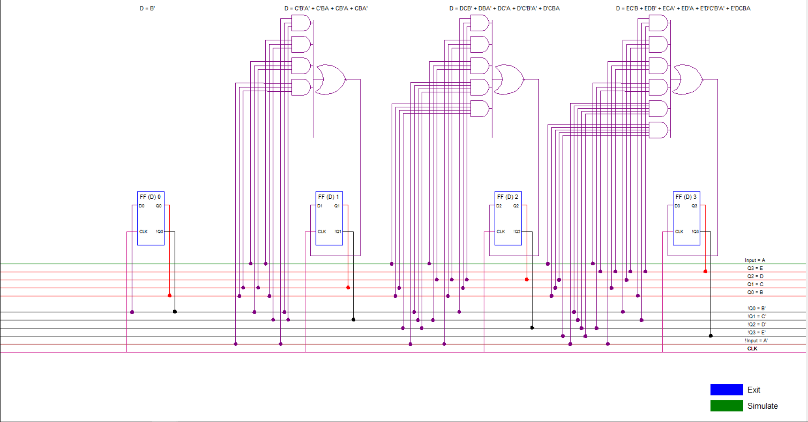

---
author:
- Kunal Adhia and Abhishek Patel
date: January 2016
title: States to a Circuit
---

# States to a Circuit

Introduction
============

Memory devices and sequential logic are underlying concepts of almost
every electronic device today, from digital clocks and timers to
computers and cell phones. There are many pieces of software which can
make the process of designing these sometimes sophisticated circuits
simpler, but not one can convert a pseudo-design into the final circuit.
However, Kunal Adhia and Abhishek Patel, sophomores at the Middlesex
County Academy for Science, Mathematics, and Engineering Technologies in
Edison, New Jersey, under electrical engineering instructor and
supervisor Enzo Paterno, have completed the task and have designed a
product which electrical engineers from all levels and categories can
use to eliminate the tedious process of conversion. A simple states
diagram can now be quickly and simply made, simulated, and converted
into a circuit which implements a D flip-flop, one of the most basic
memory devices. The program is called States to a Circuit, or STaC, and
was created with Python, a high-level programming language.

Background
==========

Just as there are organizers and planners for writing an essay, a states
diagram is the first step in designing a fully functional circuit using
sequential logic. The diagram consists of \"states\", each with an
assigned binary value. The states are the outputs of the circuit, and
are dependent on the input. However, a sequential logic design isn't as
simple as a combinational logic design, where there is one output for
each input. A sequential logic design is one in which the next state, or
output, is determined by both the input and the current state. Since the
current state is necessary for the feedback design, a form of electronic
memory is required. These \"flip-flops\" hold the current state until a
change is inputted. However, the changes are synchronized by a clock, or
a square wave alternating between a logical high state and a logical low
state with a constant frequency. The current state is linked to the next
state with a transition, which represents the input. If the transition
and current state conditionals are both satisfied, the next state will
occur. These circuits are very tedious to create, but since the process
is repetitious, it can be programmed.

The States Diagram
==================

The states diagram is a simple visual or textual pseudo-design of how
the output reflects the input. STaC provides a graphical user interface
in which the user can visually create, save, and view their states
diagrams. The states are positioned in a regular polygon, and the
transitions are represented by arrows, black or red depending on the
input condition. These states can be moved around to an orientation of
the user's choice with STaC's drag-and-drop capability. One can add and
delete states, add and delete transitions, set the initial condition, or
the first output state when the circuit is active, and relabel the
states for a more complete understanding of their states diagram.

A common example of a states diagram which STaC can easily depict is a
counter. For example, the last digit of a clock continuously progresses
through the digits 0-9, and a timer counts backwards, from 9-0. This is
actually much more complicated to create a circuit for than it seems,
but it can now be done with ease using the STaC states diagram:



<p align="center">A Modulo 10 Up/Down Counter Created with STaC</p>

The states are represented by the yellow circles, the labels, which can
be changed, are the outputs, and the arrows represent the transitions.
The above design can be used both for the last digit of a clock or a
timer. To create a clock, the input condition is set to high, and to
create a timer, the input condition is set to low. The arrow points from
the current state to the next state on the condition of the arrow. The
green state signifies the initial state. When the circuit is activated,
the green state will be visited first, and the circuit will operate from
there.

Simulation
==========

If a clock has a frequency of one Hertz, the flip-flop will receive the
clock signal every second. The simulation option in STaC allows one to
enter a data input and view the resulting output sequence to determine
if the output matches the user's desires. The user can track the
sequence and easily understand any errors he or she may have made before
converting the states diagram to the circuit.

From States to Circuit
======================

The Quine McCluskey Algorithm
-----------------------------

Karnaugh Maps are a very effective way to minimize Boolean expressions,
but only under minimal variables. These maps can also be prone to
mistakes, as they rely on visual patterns to find prime implicants.
Overall, they do not provide an algorithm to be implemented.

The Quine-McCluskey Algorithm, developed by W.V. Quine, and later
expanded on by Edward J. McCluskey, works for any number of variables,
and can be proven and explained by the following example.


We can take this 4-bit
summation of minterms and write each one out with its 4-bit binary
counterpart. In this example:


   Number of 1s   Minterms   Decimal
  -------------- ---------- ---------
                    0000        0
                    0001        1
                    0010        2
                    1000        8
                    0101        5
                    0110        6
                    1001        9
                    1010       10
                    0111        7
                    1110       14

  : Groupings Pass 1[]{label="table:2"}

In this algorithm, the first way of solving an unsimplified canonical
expression is to group it by the number of '1's in each minterm. Upon
further inspection, we see that there are 4 distinct groups in this
table. The goal of the first step of this method, called \"Finding Prime
Implicants\", is achieved by grouping together minterms which differ by
one bit.

A few examples:

-   0000 - 0001

-   0010 - 0110

-   0111 - 1111

The pattern soon emerges that using the groups formed earlier, each
minterm can only be combined with a term from an adjacent group. if we
expand each possible combination of the first group, we end up with

  ------ ------
   0000   0001
   0000   0010
   0000   1000
  ------ ------

  : Combination Pattern of Group 1[]{label="table:3"}

As we do this for each group we can simplify each equation to whatever
the binary representation is. Group 1 also does not compare with Group
3, as they are 2 bits apart, and would no have only 1 different bit.
After we expand through every group, the minterm list would be:

X = \"Don't Care\" (can be either 1 or 0) Values

  --------------- --------
     Minterms      Binary
   \[0.5ex\] 0,1    000X
        0,2         00X0
        0,8         X000
        1,5         0X01
        1,9         X001
        2,6         0X10
       2,10         X010
        8,9         100X
       8,10         10X0
        5,7         01X1
        6,7         011X
       6,14         X110
       10,14        1X10
  --------------- --------

  : Combinations After Pass 1[]{label="table:4"}

We then take a second pass, completing the same task on this group of
numbers

   Group   Decimal   Minterms
  ------- --------- ----------
            000X       0,1
            00X0       0,2
            X000       0,8
            0X01       1,5
            X001       1,9
            0X10       2,6
            X010       2,10
            100X       8,9
            10X0       8,10
            01X1       5,7
            011X       6,7
            X110       6,14
            1X10      10,14

  : Groupings Pass 2[]{label="table:5"}

Thus, taking the combinations of all the minterms with the adjacent
groups, we minimize the equations to:

If any combinations yield A,B,C,D and A,B,D,C, these can be simplified
into 1 as either of the two, by the Cumulative Property.

  ------------------- --------
       Minterms        Binary
   \[0.5ex\] 0,1,8,9    X00X
       0,2,8,10         X0X0
       2,6,10,14        XX10
  ------------------- --------

  : Combinations After Pass 2[]{label="table:6"}

Now there can be no more combinations, as none of the grouping vary by
only 1 bit. Therefore, we can produce an SOP to implement the final
solution. The MSB, or Most Significant Bit, is usually set to be the
highest letter value, so in this case, that would be D. We substitute
the final minterm groupings with letters instead of bits, omitting the
Xs. For example, X00X would represents C'B', as 1111 would be DCBA. We
also have to remember to include the groups from before that did not
make a match when combined at all, which in this example would be the
rows with the Minterms (1,5), (5,7), and (6,7). Turning each of these
binary values into letters would result in:
$f(d,c,b,a) = BA' + C'A' + C'B' + D'CB + D'CA + D'B'A$ We then need to
simplify this further, as there are many redundant terms. We know that
the minterms are the following:

  ------------- -----------
       Row       Minterms
   \[0.5ex\] 1    0,1,8,9
        2        0,2,8,10
        3        2,6,10,14
        4           1,5
        5           5,7
        6           6,7
  ------------- -----------

  : Minterms[]{label="table:7"}

\newline
As we parse through the list of minterms, we see that there is only one
occurrence of 9 and 14, which proves that the product of minterms in
that row will be needed. Since Row 1 and Row 3 cover minterms
0,1,2,6,8,9,10, and 14, these are no longer needed in the final SOP. The
new table is as follows:

  ------------- -----------
       Row       Minterms
   \[0.5ex\] 1    0,1,8,9
        2        0,2,8,10
        3        2,6,10,14
        4          1,(5)
        5         (5),(7)
        6          6,(7)
  ------------- -----------

  : Minterms Remaining - ()[]{label="table:7"}

\newpage
As we can see, Row 2 has been removed, and is therefore not in the final
Sum. Now, only 2 minterms are left to be implemented, which are 5 and 7.
We see that Row 5 covers both of them, and that finishes the SOP.

The Final Simplified Equation is: $f(d,c,b,a) = C'B' + BA' + D'CA$ There
is one more problem, however. If there are no essential prime implicants
(when there are no single occurrence minterms), we have to use Petrick's
Method.

Petrick's Method
----------------

If there are no essential implicants, this method solves the problem of
redundant terms. First, we use the number of the rows to create a POS
(Product of Sums).

For example, lets say we have: $f(c,b,a) = \sum(0,1,2,5,6,7)$ We make
the chart and simplify using the 1 bit difference rule, and obtain:

  ------------- ----------
       Row       Minterms
   \[0.5ex\] 1     0,1
        2          0,2
        3          1,5
        4          2,6
        5          5,7
        6          6,7
  ------------- ----------

  : Minterms[]{label="table:8"}

We then create Sums for each of the Minterms, as 0 occurs in Row 1 and
Row 2, the Sum would be (R1 + R2). This continues until we iterate
through all the minterms, and finally reach a final equation.
$f(c,b,a) = (R1 + R2)&(R1+R3)&(R2+R4)&(R3+R5)&(R4+R6)&(R5+R6)$ Ordered
by the Commutative Property, for aesthetics:
$f(c,b,a) = (R1 + R2)&(R1+R3)&(R4+R2)&(R4+R6)&(R5+R3)&(R5+R6)$ Then, by
the law of$(X+Y)&(X+Z) = (X + Y&Z)$ We deduce this equation to be:
$f(c,b,a) = (R1 + R2&R3)&(R4+R2&R6)&(R5+R3R6)$ Then, by the Distributive
Property:
$f(c,b,a) = (R1&R4&R5) + (R1&R2&R5&R6) + (R2&R3&R4&R5) + (R2&R3&R5&R6) + (R1&R3&R4&R6) + (R1&R2&R3&R6) + (R1&R2&R3&R6) + (R2&R3&R4&R6) + (R2&R3&R6)$
Now that it is in SOP form, we want to find the ones with the least
number of variables. This leaves us with:
$f(c,b,a) = (R1&R4&R5) + (R2&R3&R6)$ This tells us that to get the SOP,
we must include the equations from Row 1, 4 and 5, or the equations from
Row 2, 3 and 6. Substituting the equations in, we can have either of two
equations: $f(c,b,a) = (C'&B') + (B&A') + (A&C)$ or
$f(c,b,a) = (A'&C') + (A&B') + (B&C)$ Either of these two equations work
as a final SOP, and both are simplified with the same number of terms in
each.

The Final Circuit
=================

A sequential logic consists of two major components: the flip-flops and
the gates. The flip-flops hold the present state until the next state is
activated on the clock signal. The gates take the current state and
determine the flip-flops' input, depending on the next state. We chose
the D flip-flop, the most basic and widely used flip-flop. A high input
sets the memory to high, and vice versa. The logic used was
sum-of-product, or SOP, simplification. Taking the final simplified
expression, worked out by the Quine-McCluskey algorithm, each input is a
sum of a series of products of the outputs. If at least one of the
products is true, the sum will also be true. To draw the circuit, we
made each of the flip-flops outputs, along with their complements, the
input signal and complement, and the clock signal a bus. To access these
signals, a wire simply had to be connected to the bus. This allowed us
to avoid a messy circuit and easily access one signal multiple times.

\centering


Additional Features
===================

WinCupl Programming
-------------------

In addition to transforming a states diagram into a circuit, STaC can
convert a states diagram to equations which can be used to code a
programmable logic device (PLD), which can be used in real-life
circuits. For example, WinCupl, an application to program a PLD, can be
programmed to implement a sequential logic design. This requires the use
of Boolean equations for each output. Our program can create the .pld
using the derived equations in WinCupl format, so all the user needs to
do is compile the code and burn the PLD. This empowers the user to take
an electronic plan and quickly insert it into a real-life circuit.

``` {.vim}
Name    STaC ;
PartNo   00 ;
Date    01/27/2016
Revision    01 ;
Designer    STaC ;
Company    STaC ;
Assembly    None ;
Location  ;
Device    g22v10 ;

/*Input Pins*/
PIN 2 = a;


/*Output Pins*/
PIN 14 = b;
PIN 15 = c;
PIN 16 = d;
PIN 17 = e;


/*Equations*/

b.D = !b ;
c.D = !e&!c&b&!a # c&!b&!a # c&b&a # d&!c&!b&a # e&!b&a ;
d.D = d&c&a # d&!c&b # d&!b&!a # !d&c&b&!a # e&!b&a ;
e.D = !e&!d&!c&!b&a # d&c&b&!a # e&!b&!a # e&b&a ;
```

The user is also given the option to simulate the circuit to visualize
the binary output of each of the D flip-flops, given a one second clock
period.

What's Next
===========

The STaC application is a work-in-progress, as there are so many uses of
this product. What we have right now is just the skeleton of what we
plan to add to the application in the future.

The graphical user interface can only support up to sixteen states due
to the fact that the circuit can be so sophisticated, it may not fit
onto the window. However, we plan to eliminate the current limit on the
number of states and make the circuit more than just a simple window. We
plan create the circuit so that the user can scroll to capture the full
view of the circuit.

Additionally, we plan to allow the user the freedom to change the binary
output of any state of their choice. This would eliminate the number of
independent states in the diagram, allowing for a more organized
diagram.

One of the major changes we plan to implement is the option to have
multiple inputs. Having only one input for transitions is not very
practical for sophisticated designs, as a sequential design can be
affected by more than one input. Having the option to use multiple
inputs would empower the user to create just about any sequential design
possible, making our application incredibly powerful and useful.

Another important addition we could implement is a non-graphic textual
states creator. The visual diagram can be condensed into one numerical
array which the user can manually type out to create the same circuit.
This would be beneficial for programmers who intend to create a series
of circuits automatically, or professionals who understand what the
states diagram means numerically. We intend to provide an option in
which a user can create a text file, upload it to the STaC application,
and have the circuits and simplified equations created without
graphically creating the states diagram. All of these future proposals
demonstrate the power of STaC.

Bibliography
============

\[1\] 329, CMPUT. \"Quine-McCluskey.\" Quine-McCluskey: An Algorithm.
N.p., n.d. Web. \[2\] Adams, Douglas, and Eoin Colfer. \"The
Hitchhiker's Guide to the Galaxy.\" Google Books. Pan Books, n.d. Web.
26 Jan. 2016.
